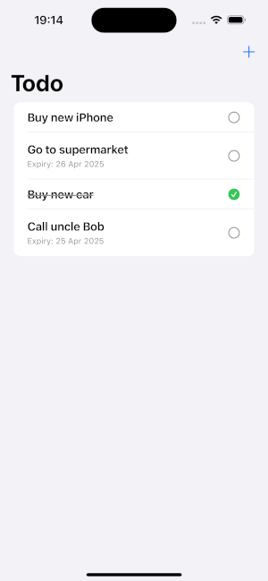
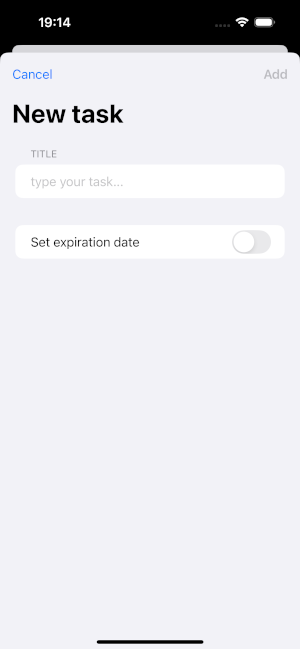

# TODO

Todo is a sleek and modern iOS App built with **SwiftUI** and **Clean Architecture**, designed to help users manage their daily tasks with ease and efficiency.

## Project Structure

This project follows the Clean Architecture principles to separate concerns and keep scalability

- SwiftUI for declarative and reactive UI
- SwiftData Native persistence layer used to store tasks locally in a lightweight and efficient way.
- Swift Concurrency (async/await) – All asynchronous operations use structured concurrency for safe and readable code execution.
- MVVM + Clean Architecture for scalability and testability
- XCTest for unit testing
- @Published + ObservableObject for reactive ViewModel
    
## Screenshots

# Support

Like what you see?

 - ⭐ **Star This repo!** — it helps more people discover it!
 - 👍🏽 **Follow me** 

Thanks for your support! 🫶🏽
